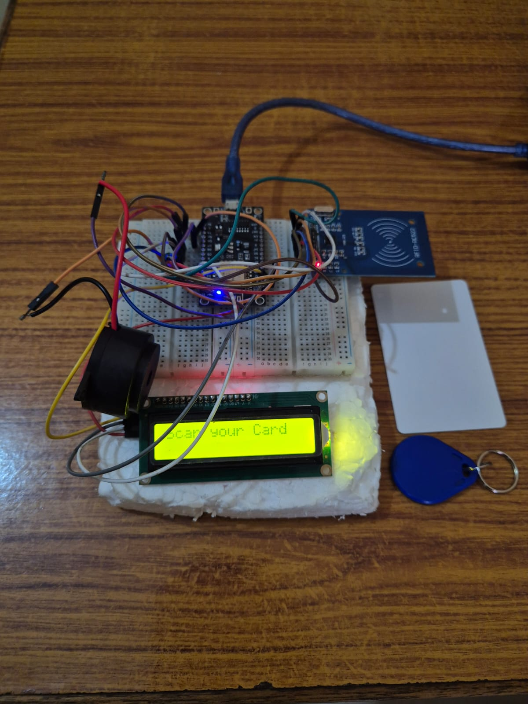

# 🚀 Smart ID Attendance System

## 📌 Overview
The Smart ID Attendance System is a real-time attendance tracking solution that uses **Face Recognition and IoT (RFID)** technologies.  
It automates attendance marking by identifying individuals through a camera and can be extended with RFID-based authentication.

---

## 🎯 Features
- 🎥 Real-time face detection using OpenCV  
- 🧠 Face recognition system  
- 📝 Automated attendance marking  
- 🌐 Web-based dashboard using Flask  
- 🔌 IoT / RFID module integration  
- 📸 Image capture functionality  

---

## 🛠 Tech Stack
- **Backend:** Python, Flask  
- **Computer Vision:** OpenCV  
- **Frontend:** HTML, CSS  
- **Hardware:** IoT / RFID Module  
- **Libraries:** NumPy, face-recognition  

---

## 📂 Project Structure
## 📂 Project Structure

SmartID-Attendance-System/
├── backend/        # Python backend logic
├── templates/      # HTML UI files
├── static/         # Images, CSS, assets
├── screenshots/    # Project screenshots
├── requirements.txt
└── README.md
---

## ▶️ How to Run

1. Clone the repository:
git clone https://github.com/VineethMenon05/Projects.git

2. Navigate to project folder:
cd SmartID-Attendance-System

3. Install dependencies:
pip install -r requirements.txt

4. Run the application:
python backend/app.py

## 🔮 Future Improvements
- 📦 Add database integration (MySQL/PostgreSQL)
- 🔐 User authentication system
- 🌐 Convert to REST API (FastAPI)
- ☁️ Deploy on cloud (AWS/Render)
- 📱 Mobile app integration

## 📸 Screenshots

### 🖥 Dashboard

### 📊 Attendance System

### 📊 Attendance View 2

### 🔌 IoT / RFID Module

## 👨‍💻 Author
Vineeth Menon
